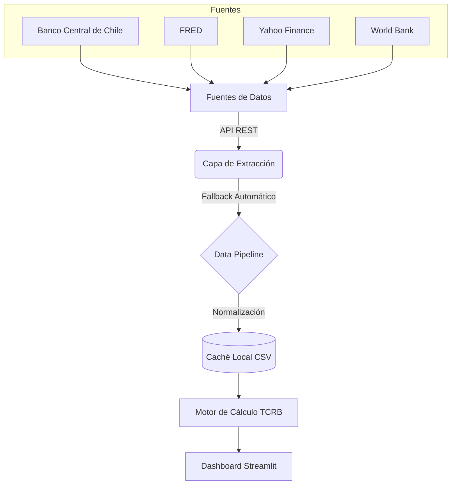

# Competitividad Turística de Chile

**Análisis automatizado del Tipo de Cambio Real Bilateral (TCRB) para evaluación de competitividad turística de Chile vs 12 países principales.**

## Arquitectura del Sistema



## Descripción

Este proyecto proporciona un producto integrado para analizar la competitividad turística de Chile mediante el monitoreo del Tipo de Cambio Real Bilateral (TCRB).

Cubre **12 países**: Argentina, Perú, Bolivia, Brasil, EE.UU., Canadá, España, Francia, Alemania, Reino Unido, China y Australia.

## Estructura del Proyecto

El proyecto sigue una arquitectura modular y estandarizada:

```
competitividad-turistica/
├── src/competitividad_turistica/
│   ├── config/             # Configuración centralizada (Pydantic BaseSettings)
│   ├── data/               # Capa de datos y ETL
│   ├── calc/               # Módulos de cálculo core
│   ├── viz/                # Visualización (Plotly)
│   ├── products/           # Apps finales (Streamlit)
│   └── cli/                # Scripts de ejecución (generate, deploy)
├── tests/                  # Suite de pruebas unitarias (Pytest)
├── jekyll/                 # Documentación para el portafolio
├── pyproject.toml          # Configuración de Setuptools y dependencias
├── Makefile                # Comandos de automatización
├── run.py                  # Punto de entrada unificado del CLI
└── .github/workflows/      # CI/CD Pipeline (GitHub Actions)
```

## Instalación y Uso

### Requisitos
- Python 3.10 o superior

### Instalación Local

1. Instalar dependencias de desarrollo (recomendado):
   ```bash
   make install-dev
   ```
   Esto instalará el proyecto en modo editable y configurará los hooks de `pre-commit`.

2. Para una instalación de solo ejecución:
   ```bash
   make install
   ```

## Comandos del Pipeline (`run.py`)

El proyecto utiliza un punto de entrada unificado para todas las tareas:

| Comando | Acción |
|---------|--------|
| `python run.py assets` | Ejecuta el pipeline de datos y actualiza la caché local. |
| `python run.py ver` | Lanza el dashboard interactivo de Streamlit. |
| `python run.py test` | Ejecuta la suite de pruebas y el linter. |
| `python run.py deploy` | Copia los resultados y documentación al portafolio Jekyll. |
| `python run.py all` | Ejecuta el pipeline completo (assets + deploy). |

También puedes usar el `Makefile` para estos comandos (ej: `make assets`, `make ver`, `make test`).

## Fuentes de Datos

El sistema usa una lógica de cascada automática con fallbacks:

- **Tipo de Cambio (FX):** BCCh API → Yahoo Finance.
- **Inflación (IPC):** BCCh API → FRED → World Bank → INDEC (para Argentina).
- **Paralelos:** Bluelytics (Dólar Blue en Argentina).

## Fórmula TCRB

```
TCRB = (E x P_i) / P_CL

E    = Tipo de cambio nominal (unidades moneda / CLP)
P_i  = IPC país extranjero
P_CL = IPC Chile
```
**Base 100:** Todos los índices están normalizados a **2015 = 100**.

## Licencia

Proyecto de análisis de competitividad turística - 2026

---
*Última actualización: Abril 2026 (Estandarización de arquitectura)*
